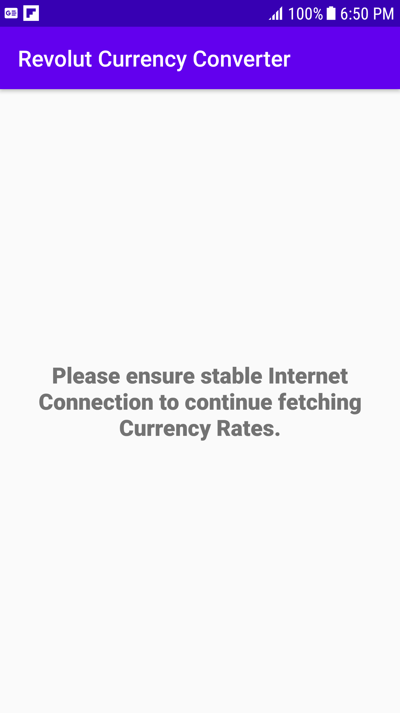

# RevolutAndroidTestApplication

This project consumes a REST service and displays currencies and its rates with respect to base currency. This was developed to assess candidate developer’s Android technical proficiency, coding knowledge and style.

## Detailed Specification

1. This Android App ingests currency data from https://hiring.revolut.codes/api/android/latest?base=GBP. The json consists of base currency as "GBP" initially and lists the other currencies with their respective rates equivalent to 1 GBP. Screen is refreshed every second.
2. Each row has a country's flag, currency code, currency name and an input field for the currency amount equivalent to the amount in base currency input field.
3. When you’re changing the amount for Base Currency, the app simultaneously updates the corresponding value for other currencies.
4. Tapping any of the row makes that row's currency as base currency and moves it to the top. Now the input field of new currency as base currency becomes the first responder for all other currencies.

## Getting Started

```
git clone https://github.com/NamrataBagerwal/RevolutAndroidTestApplication.git
```

Or the same can be imported directly in Android Studio via VCS -> Git -> Clone.

## Built With
1. Android Studio 3.6.2
1. Android Kotlin 1.3.72
2. Glide to Lazy Load Images
3. OkHttp3 for Networking Calls
4. Koin for Dependency Injection
5. Kotlin Coroutines for Thread Management
6. Variety of Test Libraries: Mockito, JUnit, Robolectric, Koin-Test, Kotlin Coroutine Test and their applicable respective Kotlin extensions

## Prerequisite
Device with Android version 5 (v21), Android Studio 3.6.2, Android Kotlin 1.3.72

## Installing
Wait for the project to get build successfully then run the app module on device/emulator. 
Recyclerview with LiveData from ViewModel will be loaded.

Each row of the table should look roughly like the following image:


Error View loaded in case of Internet Off Connection/Server Unavailability:


Video:


## Running the tests

Local Unit test cases for Activity are up and running. Select the Activity under test as test configuration and run.

## Known Issues

Performance Lag observed for reflecting the amount in other currencies whenever base currency amount changes. Sometimes, the screen is refreshed while changing the amount in base currency input field.

## Future Enhancements

Code Optimization and adding Comments.
Performance Improvement.
Coverage of more test cases.

## Authors
Namrata Bagerwal

## License
This project is open source and is purely developed as part of Coding Exercise.
